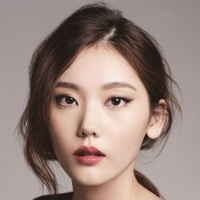

# homework
태킷 프론트엔드 스쿨 과제 저장소

## 과제 요구 사항
 - 다음 조건을 만족할 수 있도록 마크업과 스타일링을 완성하자.

- 아바타 이미지는 배경 방식이 아닌 콘텐츠 이미지( 요소)로 마크업한다.

- 아바타의 상태 정보를 알 수 있도록 정보를 제공한다.

- 아바타 이미지의 크기 - 64px X 64px

- 아바타 이미지 간의 간격 - 20px

- 회색 원 배경색 - #DBDBDB

- 초록색 원 배경색- #4CFE88

## 동작원리와 구조설계 레이아웃 생각해보기

먼저 디자인의 특징을 보자
1. 아바타 이미지는 총 8개로 구성되어있다
2. 이미지는 전부 동그라미 형태이다
3. 이미지들은 웹 페이지의 중앙에 위치해있다.  
4. 여자 이미지는 상단에 위치하고, 남자 이미지는 하단에 위치한다
5. 이미지 하단에 초록색 원 = 온라인 , 회색 원 = 오프라인 상태로 표시해야한다

link : http://127.0.0.1:5501/avatars.html

# HTML
 
        

        

          
          
        

        

          
          
        

        

          
          
        

        

          
          
        

        

          
          
        

        

          
          
        

        

          
          
        

        

          
          
        

- 우선 이미지 로고가 8개를 하나의 div 요소안에 avatars-container 클래스명으로 작성해주었다

- 그리고 처음 고민한게 이미지별로 클래스명을 따로 작성해야할까, 아니면 하나의 클래스로 통합을 해줘야하나 고민이 되었다

- 우선 첫 번째 여자 사진에 div 태그로 first-girl 이라는 클래스를 부여해주었고, 네 번째 여자 이미지, 남자 이미지까지 각각의 클래스로 부여해주었다.

- 그 다음 span 태그 circle 클래스로 이미지 로고에 상태가 offline or online 이면 초록색 원과 회색 원이 나타나게 하기 위한 코드를 작성해주었다 

- 이미지는 부모요소이고 circle이 자식요소로 들어가줘야 이미지에 circle이 생성 될 것 같았다

# CSS
      body {
      margin: 0;
      height: 100%;
      text-align: center;
    }
    /* 아바타 컨테이너 스타일 */
    .avatars-container {
      width: 370px;
      margin: 0 auto;
      padding: 280px 0; /* 상하 패딩 조정 */
    }

    /* 여자 아바타 프로필 이미지 공통 스타일 */
    .first-girl img,
    .second-girl img,
    .third-girl img,
    .four-girl img {
      width: 64px;
      height: 64px;
      border-radius: 50%;
      float: left;
      position: relative;
      margin-right: 20px; /* 각 아바타 이미지 사이의 간격을 주기 위해 margin-right 추가 */
      margin-bottom: 10px; /* 여자 아바타 그룹 전체의 아래 간격 추가 */
    }

    /* 남자 아바타 프로필 이미지 공통 스타일 */
    .first-man img,
    .second-man img,
    .third-man img,
    .four-man img {
      width: 64px;
      height: 64px;
      border-radius: 50%; 
      float: left;
      position: relative;
      margin-top: 10px;
      margin-right: 20px; /* 각 아바타 이미지 사이의 간격을 주기 위해 margin-right 추가 */
    }

    /* 공통 스타일 */
    .circle {
      position: absolute;
      bottom: 5px;
      right: 0px;
      width: 15px;
      height: 15px;
      border-radius: 8px;
      border: 1px solid white;
    }

    /* 이미지 상태에 따라 circle의 배경색을 설정 */
    .circle[aria-label="offline"] {
      background-color: #DBDBDB; /* 회색 원 배경색 */
    }

    .circle[aria-label="online"] {
      background-color: #4CFE88; /* 초록색 원 배경색 */
    }

    /* @supports (display: flex) {
      .avatars-container {
        display: flex;
        flex-wrap: wrap-reverse;
      }
    } */

- avatars-container 요소의 폭을 370px로 임의 설정하고
- margin: 0 auto 요소를 수평으로 중앙 정렬
- padding 280px 상단과 하단에 패딩을 추가하여 컨테이너의 위아래 간격 조절

- 여자 이미지   
여자 이미지 안에 각각 클래스 이름을 부여해주어서 first,second,third,four,로 작성을 하였는데 더 좋은 가독성으로 작성을 해야 할 것 같다. 클래스를 하나로 통합하는 방법이나, css에서 하나의 코드로 작성하게끔 

- 남자 이미지   
여자 이미지 코드작성과 비슷한 원리이다 

## 해결하지 못한 문제     
상태가 offline 이면 회색 배경 동그라미가 이미지 안에 생성되어야하고, 상태가 online 이면 초록색 배경 동그라미가 이미지 안에 생겨야 하는데 

# 
    /* 공통 스타일 */
    .circle {
      position: absolute;
      bottom: 5px;
      right: 0px;
      width: 15px;
      height: 15px;
      border-radius: 8px;
      border: 1px solid white;
    }

    /* 이미지 상태에 따라 circle의 배경색을 설정 */
    .circle[aria-label="offline"] {
      background-color: #DBDBDB; /* 회색 원 배경색 */
    }

    .circle[aria-label="online"] {
      background-color: #4CFE88; /* 초록색 원 배경색 */
    }   

- 위 코드에서 공통 스타일에 클래스별로 선언을 해주어야 하는지 잘 모르겠다 

# 
      /* @supports (display: flex) {
        .avatars-container {
          display: flex;
          flex-wrap: wrap-reverse;
        }
      } */

- 위 코드는 flex를 지원하는 환경에서의 코드이다

## 느낀점     
5월3일 금요일 수업을 오전에 수강하지 못해서 중요한 내용을 놓친 것 같다. 또한 아직 css 레이아웃에 대한 개념을 완벽히 숙지를 하진 못한 상태인 것 같다. 이번 주말을 통해 완벽히 숙지하도록 노력해야 할 것 같다.
